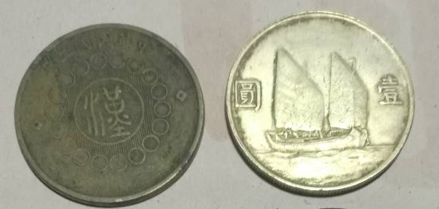
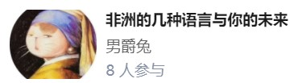

# 这是标题3
这是内容33335555


# 标题2
## 子标题1
这里有图333
<!-- img_location name="Wiz搜索框" -->


## 子标题2
这里是内容 
```
int i = 0; i = 1; 
for (int i = 0; i < 100; i++)
{
      printf("hello markdown!\n");
}
```
这里是内容


## 加入隐藏内容
测试html标签是否直接显示
<pay2show product='id'>
隐藏内容
隐藏内容

隐藏内容

</pay2show>


## 测试插入多图
这里有图2
<img_location name="图2">


这里有图3
<img_location name="图3">



插入一张新图
<img_location name="新图">


再加一张新图：
<img_location name="新图2">



